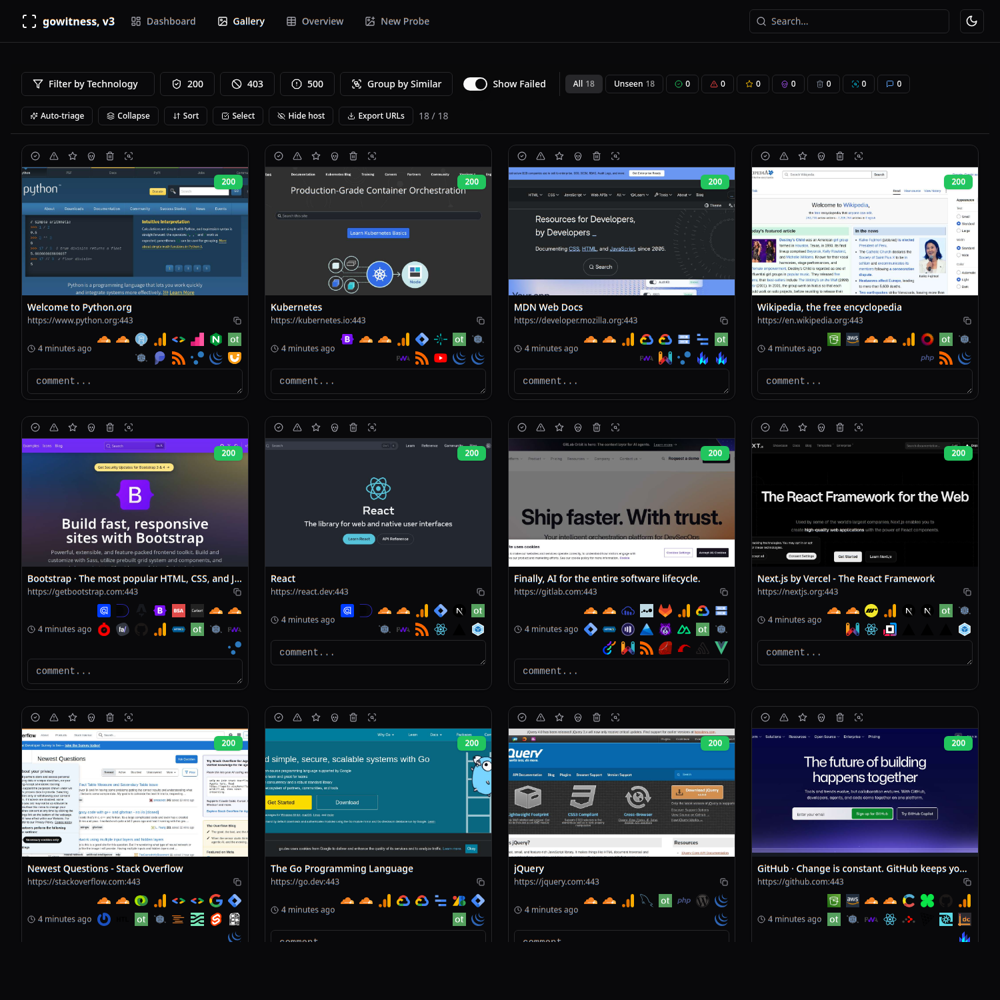
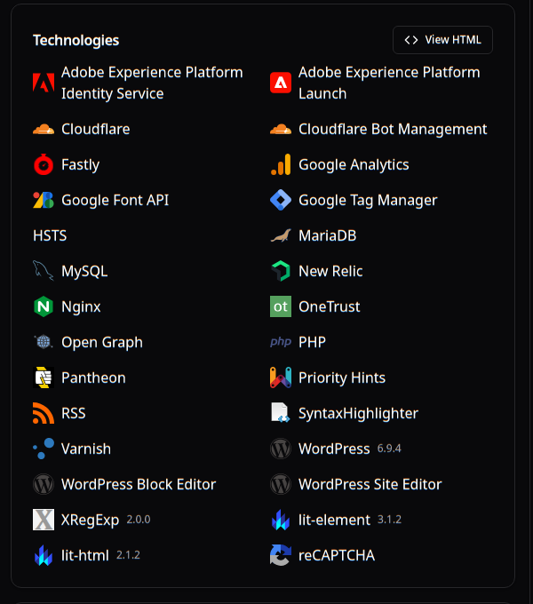
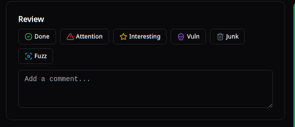

# gowitness-new

A fork of [gowitness](https://github.com/sensepost/gowitness) (v3) built for **recon triage at scale** — screenshot thousands of hosts, then review, tag, filter and fingerprint them from a single web UI.

On top of upstream gowitness it adds three things:

1. **Native technology fingerprinting** with the full Wappalyzer database, run inside the browser gowitness already drives — versions, categories and confidence, no second browser or Python.
2. A **recon triage suite** — review statuses, comments, auto-triage, bulk actions, domain/host trashing, similarity grouping and technology filters, right in the gallery.
3. **Throughput & durability** work for large, dead-host-heavy target lists.



---

## Contents

- [Technology fingerprinting](#technology-fingerprinting)
- [Recon triage suite](#recon-triage-suite)
- [Throughput & durability](#throughput--durability)
- [Install](#install)
- [Usage](#usage)
- [API](#api)
- [Build from source](#build-from-source)
- [License & credits](#license--credits)

---

## Technology fingerprinting

Upstream gowitness fingerprints technologies statically — HTTP headers and raw HTML only. This fork replaces that with a **native Go engine that runs the actual Wappalyzer fingerprint database inside the live headless-browser session gowitness already opens** for the screenshot.

Because the checks run against the rendered page, it detects the things a static pass misses: JavaScript globals (`window.React`, `__NUXT__`, framework versions), DOM markers, script sources, cookies and meta tags — the same signals the Wappalyzer browser extension / `wappalyzer-next` use, but with **no second browser and no Python runtime**.



What you get per result:

- **Versions** extracted from fingerprint patterns (e.g. `Next.js 16.2.x`, `WordPress 6.9.x`, `lit-element 3.1.2`).
- **Categories** (JavaScript frameworks, CDN, Web servers, Analytics, …).
- **Confidence** score, and `implies` resolution (detecting WordPress also surfaces PHP + MySQL).
- **Reliable icons** — technology icons are fetched once and cached, then served from gowitness itself (`/wappalyzer/icon`), instead of hot-linking GitHub on every page load. Pages with dozens of icons render consistently and work offline after the first fetch.

Detection works on both the `chromedp` (default) and `gorod` drivers. The fingerprint database is vendored from [enthec/webappanalyzer](https://github.com/enthec/webappanalyzer) and embedded in the binary.

The results are stored on each technology row (`value`, `version`, `categories`, `confidence`) and exposed through the API and the detail page.

---

## Recon triage suite

Everything below lives in the **gallery** and **detail** views of the report server.



**Review statuses** — one-click status buttons on every card and on the detail page:

| Status | Purpose |
|--------|---------|
| Done | Reviewed, nothing interesting |
| Attention | Needs a closer look |
| Interesting | Worth investigating |
| Vuln | Confirmed vulnerability |
| Junk | Noise (card fades out) |
| Fuzz | Queued for content discovery / fuzzing |

Clicking an active status clears it; a colored left border shows the current state.

**Comments** — a text field under every card with debounced autosave.

**Auto-triage** — heuristically tags results from title / tech / path signals (e.g. *known app*, *login panel*), so you can jump straight to what matters instead of eyeballing every card.

**Bulk actions** — enter *Select* mode to tag, set review status, or trash many hosts at once. Available in the gallery and on search results.

**Domain / host trashing** — hide noisy hosts or entire domains from the gallery by substring match (wildcard-style parking pages, CDN 403 walls, etc.). Trashed hosts can be listed, restored, and suggested automatically.

**Group by Similar** — collapse near-identical screenshots using perception hashing, so 500 copies of the same parked page become one group.

**Filters** — filter the gallery by:
- HTTP status class (`2xx`, `4xx`, `5xx` — matches the whole hundreds-class),
- detected technology,
- review status (done / attention / interesting / vuln / junk / unseen / commented).

**Export** — `GET /api/review/export` produces a markdown summary of every tagged and commented host; *Export URLs* dumps the current (filtered) host set for feeding into other tools.

---

## Throughput & durability

Tuned for large recon lists where a big fraction of targets are dead (NXDOMAIN, firewalled, TLS-fail, hanging):

- **TCP liveness pre-filter** — a cheap dial stage in front of Chrome culls dead hosts in ~3s instead of burning a full navigation timeout per worker. On dead-heavy lists this is an order-of-magnitude wall-clock win; on all-live lists it's a no-op.
- **Auto-tuned worker count** — `--threads 0` picks a sensible core-scaled default; explicit `--threads` still overrides.
- **Input dedup** — duplicate URLs are dropped at the reader (recon merge lists are often 10–50% dupes).
- **SQLite durability** — WAL journal mode, `synchronous=NORMAL`, `busy_timeout`, so a `kill -9` mid-scan doesn't roll back committed results.

### Measured impact

The pre-filter is the dominant factor, and its speedup is essentially a function of **how many hosts in the list are dead / hanging** — every host that never reaches Chrome saves a full navigation timeout. Representative wall-clock results (same lists, `chromedp`, identical output):

| Target profile | Speedup vs. no pre-filter |
|----------------|---------------------------|
| All hosts hanging (firewalled / TCP black-hole) | **~30×** |
| Dead / firewalled-heavy tail (~75% dead) | **~9–37×** |
| Mixed, mostly resolvable recon list | **~1.5–2×** |
| All hosts live | **~1×** (pre-filter is a no-op) |

Rule of thumb: **speedup ≈ the fraction of dead hosts in the list.** Firewalled and NXDOMAIN-heavy recon tails land in the high-multiplier regime; a clean all-live list gets only the dedup + thread-tuning gain. Output is identical either way — the pre-filter only removes hosts that would have failed anyway.

> Technology fingerprinting adds one in-page evaluation per screenshotted host (a few ms against the already-rendered page), so it does not meaningfully change scan throughput.

---

## Install

Download the binary from [Releases](../../releases) or [build from source](#build-from-source), then put it on your `PATH`:

```bash
cp gowitness-new ~/.local/bin/gowitness-new   # or /usr/local/bin
```

Requires a Chrome/Chromium binary for scanning (`--chrome-path` to point at a specific one).

## Usage

Scan a list of targets:

```bash
gowitness-new scan file -f urls.txt \
  --write-db --write-db-uri "sqlite://gowitness.sqlite3" \
  --screenshot-path ./screenshots \
  --threads 0            # auto-tune workers
```

Other scan modes work exactly like upstream:

```bash
gowitness-new scan single --url https://example.com
gowitness-new scan nmap  -f nmap.xml
gowitness-new scan cidr  192.168.0.0/24
```

Review the results in the web UI:

```bash
# from the directory with gowitness.sqlite3 and screenshots/
gowitness-new report server

# or with explicit paths
gowitness-new report server \
  --db-uri "sqlite://gowitness.sqlite3" \
  --screenshot-path ./screenshots \
  --port 7171
```

Open `http://127.0.0.1:7171`.

## API

Technology data:

```
GET  /api/wappalyzer               technology-name -> icon URL map
GET  /wappalyzer/icon?tech=<name>  a single cached technology icon
GET  /api/results/detail/{id}      result incl. technologies[].{value,version,categories,confidence}
```

Review & triage:

```
GET  /api/review/stats                     counts per status
GET  /api/review/export                     markdown export of tagged/commented hosts
POST /api/review/{id}                       {"status":"attention","comment":"text"}
POST /api/review/bulk                       {"ids":[1,2,3],"status":"junk"}
POST /api/review/auto-tag                   run heuristic auto-triage
GET  /api/results/gallery?review=<status>   filter: done|attention|interesting|vuln|junk|unseen|commented
```

Host trashing:

```
GET  /api/trash            list trashed host patterns
POST /api/trash            add a pattern
POST /api/trash/bulk       trash many hosts
POST /api/trash/restore    restore
GET  /api/trash/suggest    suggested noise patterns
```

Valid `status` values: `done`, `attention`, `interesting`, `vuln`, `junk`, `fuzz`, or an empty string to clear.

New tables (`reviews`, trash patterns) are created automatically in the same gowitness database; original gowitness data is never modified.

## Build from source

```bash
git clone https://github.com/dhudhsgs93-arch/gowitness-new.git
cd gowitness-new

# frontend
cd web/ui && npm ci && npm run build && cd ../..

# binary (embeds the built UI + fingerprint DB)
go build -o gowitness-new .
```

Requirements: Go 1.21+ (the module targets a recent toolchain), Node 18+.

## License & credits

Built on [gowitness](https://github.com/sensepost/gowitness) by [@leonjza](https://github.com/leonjza) / SensePost — licensed **GPL-3.0**, same as upstream. Technology fingerprints from [enthec/webappanalyzer](https://github.com/enthec/webappanalyzer).
